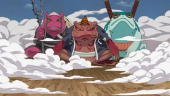
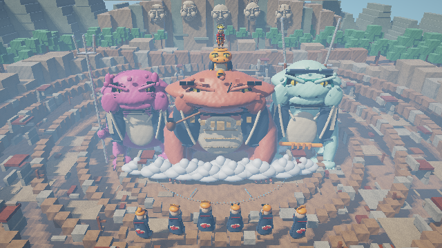

# Proyecto 2: Diorama con Raytracing

Diorama hibrido inspirado en la llegada de Naruto en Modo Sabio durante la invasion de Pain. El proyecto esta escrito en Rust puro, sin librerias externas, e implementa un raytracer desde cero con cubos texturizados, elipsoides y capsulas analiticas.

La escena muestra Konoha destruida, el crater de la aldea, Monte Hokage y las invocaciones Gamabunta, Gamaken y Gamahiro. Gamakichi se encuentra sobre Gamabunta, Naruto esta sobre Gamakichi con su traje de Modo Sabio y los Seis Caminos de Pain esperan en el borde del crater.

## Caracteristicas

- Diorama construido con cubos texturizados proceduralmente.
- Elipsoides matematicos para superficies organicas continuas en sapos, humanos, ojos, cabello y humo.
- Capsulas matematicas para extremidades, dedos, armas, cuerdas y lineas curvas sin escalones de voxeles.
- Mas de 25,000 triangulos con normales interpoladas y BVH propio para cabezas continuas, torsos, extremidades articuladas, manos, dedos y capas esculpidas.
- Camara tipo dron elevada con orbita de 360 grados, amplio rango vertical, acercamiento y direccion de mirada mediante el mouse.
- BVH para acelerar la interseccion de miles de cubos.
- Renderizado paralelo usando los nucleos disponibles del procesador.
- Sombras suaves, iluminacion difusa, brillo especular y niebla atmosferica.
- Modo HD con microrelieve procedural, oclusion ambiental de contacto y revelado cinematografico ACES.
- Reflexion en armas, protectores y superficies metalicas.
- Refraccion y transparencia en chakra, humo y nubes de invocacion.
- Skybox procedural con horizonte, sol y nubes.
- Konoha destruida en 360 grados dentro de un socavon de cinco terrazas que abarca toda la aldea, rodeado por bosque, cordillera y Monte Hokage.
- Monte Hokage integrado en una montana distante con cinco rostros de relieve suave, perfiles profundos y rasgos individuales de mandibula, nariz, parpados, boca, cabello y edad.
- Personajes modelados con formas suaves, cubos de detalle, volumen completo, rasgos faciales, ropa segmentada y accesorios visibles desde diferentes angulos.
- Sapos redisenados con anatomia pesada y asimetrica: ancho craneal variable, hocicos proyectados, mandibulas diferenciadas, ojos hundidos y perfiles laterales profundos.
- Hombros, codos, antebrazos, munecas, patas de apoyo, palmas y dedos usan mallas de grosor variable para transmitir peso sin cilindros uniformes.
- Humo de invocacion distribuido en varias profundidades para integrar las patas con el terreno y reforzar la escala desde camaras bajas.
- Haoris construidos como paneles geometricos separados con grosor, solapas, bordes y sombras de contacto sobre el cuerpo.
- Pain y sus Caminos usan capas volumetricas trianguladas, rostros organicos diferenciados, Rinnegan en relieve y accesorios apoyados sobre la anatomia. Forman un arco frontal despejado sobre la altura real de la terraza, orientados hacia los sapos.
- Escala narrativa reforzada: las tres invocaciones principales son mas anchas y especialmente mas altas para dominar el crater, Gamakichi conserva una escala juvenil y los humanos permanecen pequenos.
- Sello de invocacion refractivo alrededor de la escena principal.

## Personajes

- **Gamabunta:** sapo gigante rojizo de craneo ancho, mandibula pesada, rostro cicatrizado, haori, pipa y vientre segmentado.
- **Gamaken:** sapo magenta robusto con craneo irregular, verrugas asimetricas, haori y sasumata metalico.
- **Gamahiro:** sapo celeste alto de expresion severa, perfil vertical, mascara ocular y dos espadas.
- **Gamakichi:** sapo naranja juvenil con piel moteada y chaleco azul.
- **Naruto:** Modo Sabio apoyado sobre Gamakichi, con proporcion humana estilizada, capa roja, ribete de llamas, traje naranja, pergamino, ojos dorados y protector metalico.
- **Seis Caminos de Pain:** seis siluetas independientes orientadas hacia los sapos, con capas Akatsuki detalladas por ambos lados, Rinnegan, piercings y peinados diferenciados.

## Materiales principales

Cada material posee textura procedural y parametros independientes de albedo, brillo especular, transparencia, reflectividad e indice de refraccion.

| Material | Textura | Efecto destacado |
| --- | --- | --- |
| Piel de Gamabunta | Variacion amplia, cicatrices y poros | Reflexion suave |
| Piel de Gamaken | Moteado organico irregular | Brillo humedo |
| Piel de Gamahiro | Bandas suaves y variacion acuatica | Reflexion suave |
| Piel de Gamakichi | Moteado naranja y pecas | Brillo humedo |
| Vientre | Poros y pliegues horizontales | Difusion mate |
| Tela y capa | Tejido, dobleces y variaciones de color | Reflexion minima |
| Metal | Rayones direccionales | Reflexion alta |
| Chakra | Pulso cromatico procedural | Transparencia y refraccion |
| Nubes y humo | Ruido de baja frecuencia | Transparencia |
| Roca y crater | Grietas, grava y erosion | Superficie rugosa |
| Madera y cuerda | Vetas y patron trenzado | Reflexion baja |
| Follaje distante | Grupos de hojas, ruido y luz superior | Reflexion suave |
| Montana distante | Estratos y erosion procedural | Superficie mate |
| Pain | Piel, cabello naranja y Rinnegan anillado | Brillo ocular y metal reflectante |

## Ejecutar

Resumen de la escena:

```bash
cargo run --release -- --summary
```

Render rapido de prueba:

```bash
cargo run --release -- --width 320 --height 180 --samples 1 --depth 2 --output renders/preview.bmp
```

Render recomendado:

```bash
cargo run --release -- --width 960 --height 540 --samples 2 --depth 4 --angle 82 --zoom 0.90 --output renders/final.bmp
```

Render HD final (1280x720, dos muestras por eje y cuatro rebotes):

```bash
cargo run --release -- --hd --angle 90 --zoom 0.98 --elevation 2
```

Encuadre cinematografico desde el interior del crater:

```bash
cargo run --release -- --hd --cinematic
```

El modo `--hd` activa relieve que modifica las normales de iluminacion, sombras de contacto mediante oclusion ambiental, reflejos con dureza propia por material y tone mapping ACES. Es un render de entrega y puede tardar varios minutos; la ventana interactiva desactiva automaticamente estos calculos pesados.

Para una captura mas fina se puede agregar `--samples 3` despues de `--hd`. Esa variante tarda bastante mas, por lo que conviene reservarla para la imagen o el video definitivo.

Este ajuste conserva una relacion 16:9 y es razonable para una computadora con graficos integrados. Para una captura mas limpia se puede subir a `--samples 3`, aceptando un tiempo de render considerablemente mayor.

Ejecutar las pruebas:

```bash
cargo test
```

## Ventana interactiva

Abrir el diorama en una ventana nativa de Windows:

```bash
cargo run --release -- --window --width 400 --height 225
```

Controles:

- Mover el mouse dentro de la ventana: dirigir la mirada de la camara.
- `a` / `d` o flechas izquierda/derecha: orbitar alrededor de la escena.
- `w` / `s` o flechas arriba/abajo: subir y bajar la camara.
- `+` / `-`: acercar y alejar la camara.
- `1`: plano general de la llegada.
- `2`: primer plano de Naruto y los sapos.
- `3`: plano lateral de Pain y los Seis Caminos.
- `4`: encuadre del Monte Hokage.
- `5`: vista aerea del crater y Konoha destruida.
- `r`: generar el nivel maximo de detalle y antialiasing.
- `Esc`: cerrar la ventana.

La ventana usa una resolucion interactiva y ajustes moderados para responder bien en graficos integrados. El render final puede generarse despues con mayor resolucion, muestras y profundidad.

La ventana usa resolucion dinamica entre 256 y 320 pixeles de ancho durante la navegacion, conservando texturas, relieve procedural, iluminacion directa, brillo especular, una muestra de sombra y reflejo ambiental. No se desplazan ni deforman fotogramas anteriores: cada imagen mostrada corresponde a una camara renderizada realmente. El render se ejecuta en un hilo independiente con una cola de ultimo encuadre, por lo que mouse y teclado siguen respondiendo mientras se calcula la imagen. Las cinco camaras recorren la ruta angular mas corta mediante transiciones suaves que pueden cancelarse inmediatamente con el mouse o el teclado.

Al detener la camara se genera un enfoque de hasta 480 pixeles con oclusion ambiental, sombras suaves y rayos secundarios. Al presionar `r` se agrega antialiasing 2x2. El titulo de la ventana muestra la resolucion y el nivel activo (`movimiento`, `enfoque` o `detalle`). El encuadre inicial incluye el arco exterior de Pain y el BVH de cubos, triangulos, elipsoides y capsulas se construye una sola vez.

## Camara por consola

```bash
cargo run --release -- --interactive --width 320 --height 180 --samples 1 --depth 2
```

Controles:

- `a` / `d`: rotar la camara.
- `w` / `s`: subir y bajar la camara.
- `+` / `-`: acercar y alejar la camara.
- `r`: volver a renderizar.
- `q`: salir.

Cada vista interactiva se guarda en `renders/interactive.bmp`.

## Animacion

Probar la orbita completa con pocos cuadros:

```bash
cargo run --release -- --width 320 --height 180 --samples 1 --depth 2 --frames 24 --animate
```

Generar los 120 cuadros para el video final:

```bash
cargo run --release -- --width 640 --height 360 --samples 2 --depth 3 --frames 120 --animate
```

Los cuadros se guardan en `frames/` con numeracion consecutiva. Primero conviene revisar la prueba de 24 cuadros; el render final puede tardar bastante en graficos integrados. Luego los cuadros pueden importarse como secuencia de imagenes en el editor de video elegido para producir el archivo que se enlazara en este README.

## Evidencia de raytracing

- **Reflexion:** armas, protectores metalicos y detalles pulidos reflejan el skybox mediante rayos secundarios y Fresnel.
- **Refraccion:** el sello y las corrientes de chakra alteran los rayos que los atraviesan con un indice de refraccion propio.
- **Transparencia:** el humo de invocacion y el polvo dejan ver parcialmente la escena posterior.
- **Sombras:** cada punto consulta visibilidad hacia varias muestras de la luz para producir bordes suaves.
- **Skybox:** el cielo procedural incluye horizonte, sol, resplandor, nubes altas y polvo atmosferico.
- **Formas mixtas:** cubos, elipsoides, capsulas y mallas triangulares comparten texturas, iluminacion, sombras y rayos secundarios dentro del mismo trazador.

## Opciones

```text
--width N       ancho del render
--height N      alto del render
--frame N       cuadro individual de la orbita
--frames N      cantidad de cuadros de la animacion
--animate       renderiza todos los cuadros en frames/
--window        abre una ventana nativa interactiva
--interactive   abre el control de camara por consola
--summary       muestra el resumen de la escena
--hd            activa el render final 1280x720 con efectos avanzados
--cinematic     usa una camara baja dentro del crater
--angle N       angulo manual de camara en grados
--elevation N   desplazamiento vertical de la camara
--zoom N        acercamiento de camara
--samples N     muestras por eje
--depth N       rebotes maximos de raytracing
--output PATH   archivo BMP o PPM de salida
```





## Video
https://youtu.be/PUuCfZ-VXG4